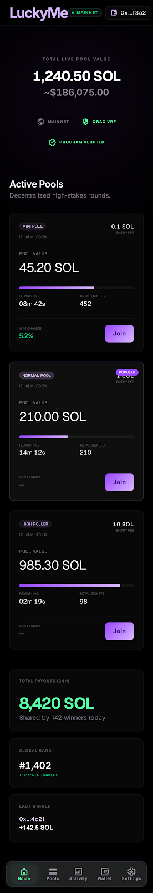
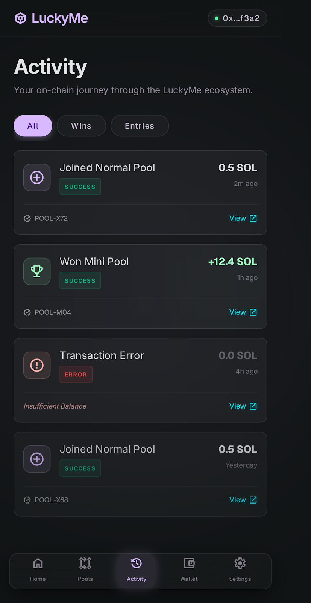
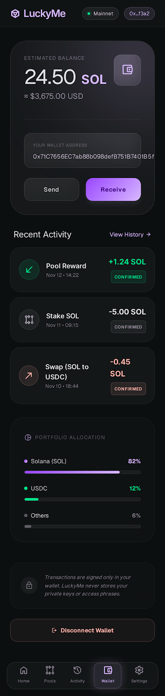
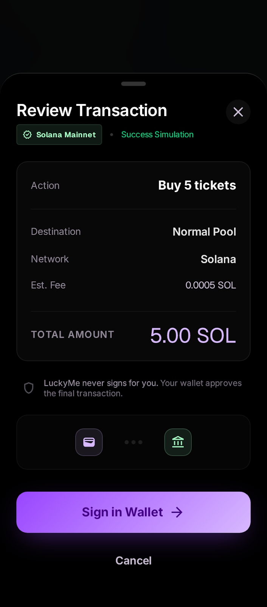

# LuckyMe

LuckyMe is a Solana mobile-first luck pool game for fixed-entry rounds. Users
connect a Solana wallet, choose a pool, review the ticket transaction, and sign
with their wallet. The project includes the Solana Mobile / Seeker app and the
browser web app at `https://www.lucky-me.app/play/`.

Pool math is transparent: fixed ticket price, total tickets, winner chance,
prize, jackpot contribution, and treasury fee. Results and payouts are executed
by the Solana program.

> Production status (verified on 2026-07-20): the Solana program, backend,
> redesigned public web app, settlement keeper, operations monitor, protected
> Admin, Seeker referral backend and manual Seeker Pass distribution service
> are live. The current verified Android release candidate is `1.2.2` / code
> `15`, package `com.luckyme.seeker`; publication remains a separate operator
> action. The authenticated SKR Database prepares at most 50 recipients per
> wallet approval and never stores an authority private key.

## Funded-round rules

The one-hour timer starts only when the first ticket is confirmed. A draw is
valid only when the round reaches its target before the timer expires:

| Pool | Ticket target | Distinct-wallet target |
| --- | ---: | ---: |
| Mini | 25 | 1 |
| Normal | 13 | 1 |
| High | 3 | 1 |
| Premium | 3 | 3 |

Mini, Normal, and High count total tickets, not distinct players: one wallet
may buy the complete target. Premium keeps one ticket per wallet and requires
three distinct wallets. If a round expires below either applicable target, no
ORAO request or winner draw is created. The authorized settlement keeper
automatically returns every ticket's full purchase principal and closes each
Entry account so its rent returns to that player. Solana network fees already
paid to the network cannot be refunded. There is no player claim step.

## Screenshots

<p>
  
  
  
  
  
</p>

[All screenshots](docs/store-listing/screenshots)

## Product Overview

- **Release mode:** `MAINNET_RELEASE`
- **Network target:** Solana `mainnet-beta`
- **Wallet chain:** `solana:mainnet`
- **Program ID:** `4bndxrGfuUcSLJnbCu8vs9WZ4qHdKGwcoeCybNThkrA3`
- **Mobile app:** Expo React Native with Mobile Wallet Adapter
- **Web app:** static landing and browser dapp shell for `lucky-me.app`
- **Backend:** transaction builder and public state API
- **Randomness:** ORAO VRF only for expired rounds that reached their draw
  minimum; below-target rounds enter refund mode without an ORAO request.
- **Player custody:** the backend never signs player transactions and never
  custodies user funds.
- **Device smoke test:** Victor reported the signed Seeker build tested on a
  Seeker phone on 2026-07-07.

The app builds an unsigned transaction, the connected wallet signs it, and the
backend submit relay is disabled by default. Users see the amount, pool,
connected wallet, Solana mainnet network, and expected ticket behavior before
signing. The legal/community surface is `Links` only: Terms, Privacy, Support,
and future X/Discord placeholders.

## Repository Layout

```text
programs/luckyme/        Anchor program
idl/                     Generated IDL
sdk/                     TypeScript IDL type helper
scripts/                 Operator and keeper transaction builders
backend/                 Public state API and transaction builders
app-seeker/              Solana Mobile / Seeker Expo app
docs/                    Publishing, APK signing, operations, and handoff docs
tests/                   Node and Anchor integration tests
sim/                     Economic simulator and unit tests
```

## Mainnet Environment

Set these backend variables for `MAINNET_RELEASE`:

```bash
export LUCKYME_RELEASE_MODE=MAINNET_RELEASE
export LUCKYME_SOLANA_CLUSTER=mainnet-beta
export ANCHOR_PROVIDER_URL=https://api.mainnet-beta.solana.com
export LUCKYME_RANDOMNESS_MODE=orao_vrf
export LUCKYME_PRODUCTION_RANDOMNESS=true
export CORS_ORIGIN=https://lucky-me.app,https://www.lucky-me.app
export ENABLE_TRANSACTION_SUBMIT=false
export LUCKYME_PUSH_TOKEN_STORE=/var/lib/luckyme/push-tokens.json
```

Set these app variables for the Solana Mobile dApp Store APK build:

```bash
export EXPO_PUBLIC_LUCKYME_RELEASE_MODE=MAINNET_RELEASE
export EXPO_PUBLIC_LUCKYME_STORE_BUILD=true
export EXPO_PUBLIC_LUCKYME_API_URL=https://api.lucky-me.app
export EXPO_PUBLIC_LUCKYME_WALLET_CHAIN=solana:mainnet
export EXPO_PUBLIC_LUCKYME_WALLET_RPC_URL=https://api.mainnet-beta.solana.com
export EXPO_PUBLIC_LUCKYME_SOLANA_CLUSTER=mainnet-beta
export EXPO_PUBLIC_LUCKYME_PROGRAM_ID=4bndxrGfuUcSLJnbCu8vs9WZ4qHdKGwcoeCybNThkrA3
export EXPO_PUBLIC_LUCKYME_TERMS_URL=https://lucky-me.app/terms
export EXPO_PUBLIC_LUCKYME_PRIVACY_URL=https://lucky-me.app/privacy
export EXPO_PUBLIC_LUCKYME_SUPPORT_URL=https://lucky-me.app/support
```

Release validation rejects:

- missing production environment variables;
- loopback or LAN backend URLs;
- non-HTTPS mainnet RPC URLs;
- non-mainnet wallet chain values;
- placeholder terms, privacy, or support URLs;
- production commit-reveal randomness.

## Backend Setup

```bash
npm install
npm run app:validate:production
node backend/src/server.mjs
```

Important backend behavior:

- `GET /config` exposes release mode, cluster, Program ID, randomness mode,
  economics, and public release checks.
- `GET /pools` reads the Solana program state. In `MAINNET_RELEASE`, unavailable
  on-chain state returns an unavailable/error state rather than fake pool data.
- Public pool state is cached once per short state window; wallet-specific
  Entry data is enriched separately with bounded caching and batched RPC reads.
  Concurrent requests for the same wallet share one in-flight read.
- `POST /transactions/buy-tickets` builds and simulates an unsigned ticket
  transaction for the connected wallet.
- `POST /transactions/refund-entry` is retired and returns `410`; below-target
  refunds are executed only by the authorized, journaled settlement keeper.
- `POST /transactions/request-randomness`,
  `POST /transactions/request-orao-randomness`, and
  `POST /transactions/settle-provider-round` support the ORAO keeper flow.
- `POST /transactions/submit` is disabled unless explicitly enabled; keep it
  disabled for production.
- `POST /notifications/register` stores opted-in Expo push tokens for the
  APK notification flow; responses return only a token hash.

Round notification sender:

```bash
CONFIRM_MAINNET_PUSH_ALERTS=true \
LUCKYME_PUSH_SEND=true \
npm run push:round-alerts
```

The sender reads confirmed on-chain rounds and sends max two notifications per
active round per registered APK token: countdown started and last 10 minutes.
Without `LUCKYME_PUSH_SEND=true`, it runs as a dry-run.

Incident forensics:

```bash
ANCHOR_PROVIDER_URL=https://api.mainnet-beta.solana.com \
npm run incident:forensics -- --pool mini --round 2
```

The report is read-only and prints pool vault balances, entries, active rounds,
and ORAO randomness state for the deployed mainnet program.

## Web App

The public site lives under `site/lucky-me.app` and deploys as static files to
`/var/www/luckyme/public`.

- Landing: `https://www.lucky-me.app/`
- Browser dapp: `https://www.lucky-me.app/play/`
- Player rules: `https://www.lucky-me.app/how-to-play/`
- Legal/support pages: `/terms/`, `/privacy/`, `/support/`

The web wallet UI exposes one public `Connect wallet` action. After click it
shows detected Solana browser wallets. On mobile Chrome, where Solana providers
are not injected, it also offers neutral app-browser actions for Phantom,
Solflare, and Backpack. WalletConnect/Reown is configured through
`window.LUCKYME_WALLETCONNECT_PROJECT_ID` in `/config.js`; the public Reown
project must keep `https://lucky-me.app` and `https://www.lucky-me.app`
allowlisted.

## Seeker Referral League And Admin

The referral flow is available only in the Android Seeker app and verifies both
wallet ownership and an authentic Seeker Genesis Token. An invite code is
optional and immutable after it is accepted. Shared invites open the LuckyMe
listing in the Solana dApp Store; the recipient enters the separate `LM-XXXXXX`
code in the app before verification.

Production qualification is calculated automatically from the append-only
settlement archive and distinct app-activity days. A referred owner qualifies
after three completed rounds with a winner on three different days plus seven
active LuckyMe days. Cancelled or refunded rounds do not count.

The protected, read-only `/admin/` page has separate Server Status, Treasury
Estimate, Winners and Referrals tabs. The referral tab shows inviter/invitee
identity, immutable binding status and qualification progress without adding
any game or settlement write path.

## Solana Mobile APK Build

```bash
cd app-seeker
npm install
npm run validate:production
npm run typecheck
npm run doctor
```

The app defaults wallet authorization to `solana:mainnet` and uses
`https://api.mainnet-beta.solana.com` as the fallback wallet RPC. The
`dapp-store` profile still requires explicit production env through:

- `app-seeker/scripts/validate-production-env.mjs`
- `app-seeker/app.config.js`

For EAS cloud builds, set `EXPO_PUBLIC_LUCKYME_API_URL`,
`EXPO_PUBLIC_LUCKYME_WALLET_RPC_URL`, `EXPO_PUBLIC_LUCKYME_TERMS_URL`,
`EXPO_PUBLIC_LUCKYME_PRIVACY_URL`, and `EXPO_PUBLIC_LUCKYME_SUPPORT_URL` in the
EAS project environment or as EAS secrets before the `dapp-store` build. The
build must use HTTPS production URLs, not loopback or LAN addresses.

The current signed update candidate is app version `1.1.9`, Android
`versionCode` `12`, and keeps package `com.luckyme.seeker`. It includes the
tested ticket picker, smooth countdown, notification icon and permission flow,
production FCM configuration, current refund/rent explanations, a focused Home
screen, the Seeker Referral League rules and prize table, the optional one-time
review request, and the Social navigation screen with a permanent Discord
`#welcome` invite. It also keeps the explicit block on unused overlay and
legacy external-storage permissions.

Build the Solana dApp Store APK with EAS:

```bash
cd app-seeker
eas build --platform android --profile dapp-store
```

For a local build with Android SDK/NDK installed:

```bash
cd app-seeker
eas build --platform android --profile dapp-store --local
```

## APK Signing And Verification

The Solana dApp Store accepts signed APK files. `app-seeker/eas.json` contains a
`dapp-store` profile with `android.buildType` set to `apk`.

Create a dedicated dApp Store signing key if you manage signing locally:

```bash
keytool -genkey -v -keystore luckyme-dapp-store.keystore \
  -alias luckyme-dapp-store \
  -keyalg RSA \
  -keysize 2048 \
  -validity 10000
```

Verify the signed APK:

```bash
apksigner verify --print-certs app-release.apk
```

Do not commit:

- keystores;
- key passwords;
- Expo credentials;
- Solana keypairs;
- Publisher Portal API keys.

## Solana Mobile Publishing Checklist

Based on the official Solana Mobile dApp Store docs, prepare:

- Prepare a release-ready APK signed with the release key.
- Prepare app metadata: name, description, screenshots, and icon.
- Use a Solana browser-extension wallet with enough SOL for submission fees and
  storage costs.
- Review the Publisher Policy and Developer Agreement.
- Create a Publisher Account in the Publisher Portal and complete KYC/KYB.
- Connect the publisher wallet and keep access to it for future submissions.
- Set the storage provider for APK and asset uploads.
- Add LuckyMe app details and submit the first release version.
- After submission, monitor the publisher email for review results.

Optional CLI publish path:

```bash
npm install -g @solana-mobile/dapp-store-cli
export DAPP_STORE_API_KEY=<publisher-portal-api-key>
dapp-store \
  --apk-file ./app-release.apk \
  --keypair ./publisher-keypair.json \
  --whats-new "$(cat docs/store-listing/whats-new-v1.1.0.txt)"
```

The CLI path requires an app already created in the Publisher Portal, an App NFT
minted, a signed APK, a Solana signer keypair, and a Publisher Portal API key.

## Store Metadata

Store listing material is in `docs/store-listing/`:

- `short-description.txt`
- `full-description.md`
- `whats-new-v1.0.0.txt`
- `whats-new-v1.1.0.txt`
- `whats-new-v1.1.7.txt`
- `whats-new-v1.1.8.txt`
- `whats-new-v1.1.9.txt`
- `screenshot-checklist.md`
- `icon-adaptive-icon-checklist.md`
- `privacy-policy.md`
- `support-contact.md`
- `required-links.md`
- `category.txt`

`required-links.md` tracks the final terms, privacy, and support URLs that must
be configured before submitting the APK.

Store readiness is tracked in `docs/store-readiness.md`; it uses the same
`MAINNET_RELEASE`, `solana:mainnet`, `mainnet-beta`, and signed APK release
positioning as this README. `docs/release-v1.0.0-mainnet.md` is retained as
historical v1.0 evidence. The minimum-ticket `1.1.0` release-candidate evidence
and still-gated mainnet plan are recorded in the dated July 11 documents under
`docs/`.

## Solana Mobile Docs Scope

The official Solana Mobile docs specify signed APK submission, app metadata,
Publisher Portal account/KYC, publisher wallet SOL for submission/storage,
storage provider selection, Publisher Policy review, Developer Agreement review,
and optional publishing CLI requirements. LuckyMe keeps those as the
store-submission requirements in this repo.

## Validation Commands

Run the repository checks:

```bash
npm install
npm test
npm run app:validate:production
npm run app:typecheck
npm run backend:validate:production
npm --prefix app-seeker run doctor
npm run audit:mainnet-release
cargo check
cargo test
```

For production backend smoke testing:

```bash
LUCKYME_RELEASE_MODE=MAINNET_RELEASE \
LUCKYME_SOLANA_CLUSTER=mainnet-beta \
ANCHOR_PROVIDER_URL=https://api.mainnet-beta.solana.com \
LUCKYME_RANDOMNESS_MODE=orao_vrf \
LUCKYME_PRODUCTION_RANDOMNESS=true \
CORS_ORIGIN=https://lucky-me.app \
ENABLE_TRANSACTION_SUBMIT=false \
npm run backend:validate:production
```

Build and verify the Solana Mobile APK after final EAS env values are set:

```bash
npm run app:build:dapp-store
APK_PATH=/path/to/app-release.apk npm run app:apk:verify
```
