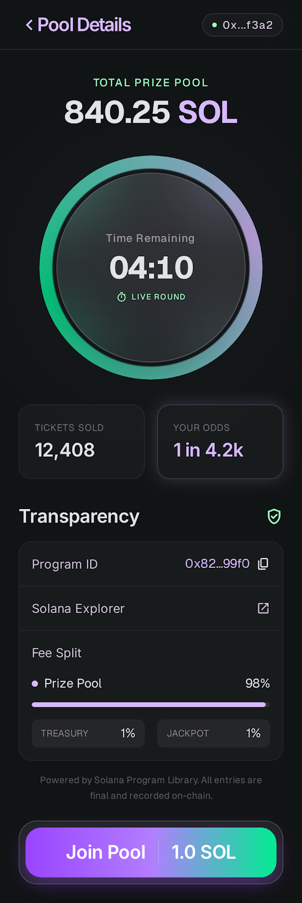
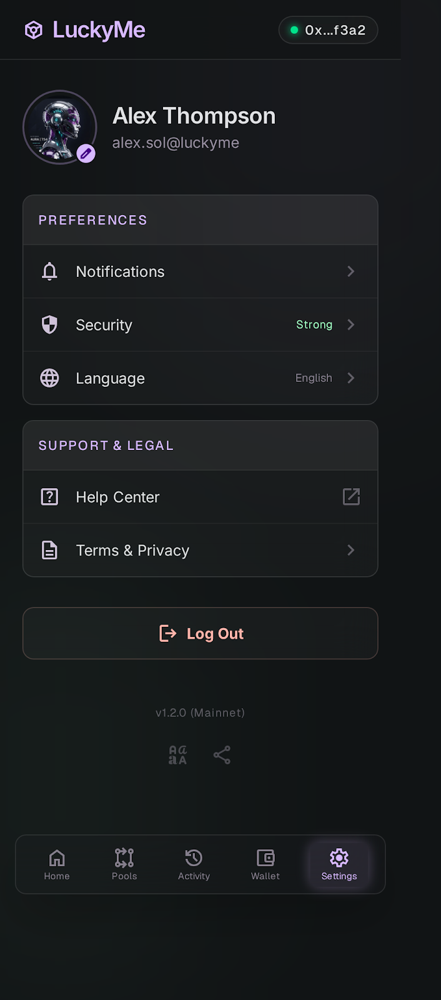
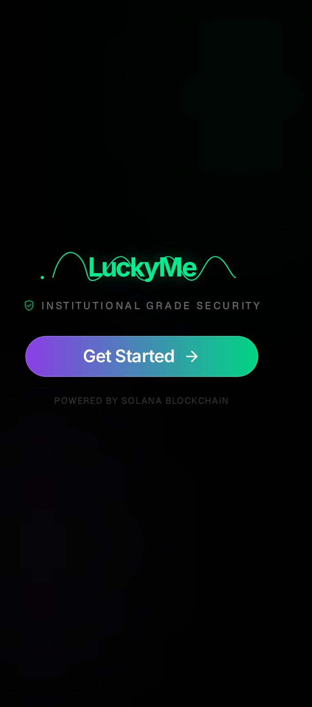
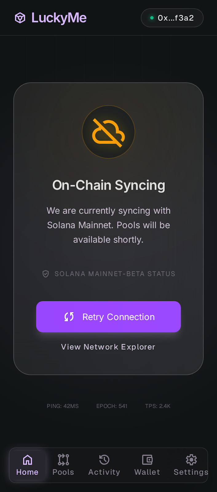

# LuckyMe Stitch Screenshots

These screenshots are copied directly from:

`/Users/victor/Downloads/stitch_luckyme_premium_solana_interface.zip`

They are the `screen.png` exports generated by Stitch for the current LuckyMe UI preview.

## Screens

| Screen | Source in Stitch ZIP | Preview |
| --- | --- | --- |
| Home | `luckyme_home_pro/screen.png` |  |
| Pool details | `pool_details_pro/screen.png` |  |
| Activity | `activity_pro/screen.png` |  |
| Wallet | `my_wallet_pro/screen.png` |  |
| Settings | `settings/screen.png` |  |
| Review transaction | `review_transaction_pro/screen.png` |  |
| Syncing | `syncing_pro/screen.png` |  |
| Success | `success/screen.png` |  |
| Welcome | `welcome_to_luckyme/screen.png` |  |
| Unavailable | `luckyme_unavailable/screen.png` |  |

